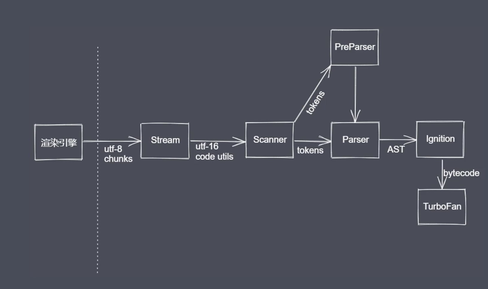

# JS 性能优化

## 内存管理

- 内存管理:开发者主动申请空间,使用空间,释放空间
- 管理流程:申请-使用-释放

1. JS 中的垃圾

- js 中的内存管理是自动的
- 对象不再被引用时时垃圾
- 对象不能从根上访问到时是垃圾

2. JS 中的可达对象

- 可以访问到的对象就是可达对象(引用,作用域链)
- 可达的标准就是从根出发是否能够被找到
- js 中的根就可以理解为是全局变量对象

3. js 中的引用与可达
4. GC 算法(垃圾回收)

- 垃圾:程序中不再需要或不再能访问到的对象

### 常见的 GC 算法

1. 引用计数

- 核心思想:设置引用数,判断当前引用数是否为 0
- 引用计数器
- 引用关系改变时修改引用数字,引用数字为 0 时立即回收

优点:

- 发现垃圾时立即回收
- 最大限度减少程序暂停

缺点:

- 无法回收循环引用的对象
- 时间开销大

例子:

```javascript
function fn() {
  const obj1 = {};
  const obj2 = {};
  obj1.name = obj2;
  obj2.name = obj1;
  //由于相互引用,他们的引用计数器不为零,无法回收
  return "";
}
fn();
```

2. 标记清除

- 核心思想:分标记和清除两个阶段完成
- 遍历所有对象并标记活动对象,如果有子引用,则递归寻找可达对象并标记
- 遍历所有对象清除没有标记的对象,同时抹掉所有标记,等待下一个工作周期重新标记
- 回收相应的空间并添加到空闲列表

优点:

- 相比于引用计数,可回收循环引用的对象

缺点:

- 回收的空间可能地址不连续,造成空间碎片化,不能最大化空间的使用

3. 标记整理

- 可以看做标记清除的增强
- 标记后先整理,后回收非活动和空闲区

优点:可获得连续地址空间

缺点:与标记清除一样不会立即回收垃圾对象

4. 分代回收

### v8 引擎

一款主流的 js 执行引擎,包括 chrome 浏览器和 node.js

v8 采用即时编译,内存设限, 一般 64 位不超过 1.5G,32 位不超过 800m

垃圾回收主要针对存在堆空间中的对象数据

#### v8 垃圾回收策略

- 采用分代回收思想
- 内存分为新生代(小空间,存活时间较短的对象,32|16m),老生代
- 针对不同对象采用不同算法:

`分代回收,空间复制,标记清除,标记整理,标记增量`

#### 新生代对象回收实现

1.  回收过程采用`复制算法,标记整理`
2.  新生代内存区分为两个等大空间
3.  使用空间为 From,空闲空间为 To
4.  活动对象存储于 From 空间
5.  标记整理后将活动对象拷贝至 To
6.  From 与 To 交换空间完成释放(释放 From)

#### 回收细节说明

- 拷贝过程中可能出现晋升
- 晋升就是将新生代对象移动到老生代
- 一轮 GC 还存活的新生代需要晋升
- To 空间的使用率超过 25%

#### 老生代对象回收

老生代对象存放在右侧老生代区域
64 位系统 1.4G,32 位 700m
老生代对象就是指存活时间较长的对象(全局变量,闭包等)

- 主要采用`标记清除,标记整理,增量标记算法`
- 首先使用标记清除完成垃圾空间的回收
- 当新生代数据移动到老生代且老生代空间不足时,采用标记整理进行空间优化
- 采用增量标记进行效率优化(即二层对象)

细节对比

- 新生代区域垃圾回收使用空间换时间
- 老生代区域垃圾回收不适合复制算法

#### 总结

v8 是一款主流的 js 执行引擎
v8 内存设置上限(1,够用,2,过大影响垃圾回收效率,超过用户忍耐时间)

### Performance 工具

GC 的目的是为了实现内存空间的良性循环,良性循环的基石是合理使用,可使用 performance 监控

1. 内存问题的体现

- 页面延迟加载或经常性暂停
  可能存在频繁的内存回收,可能有代码快速占满内存
- 页面持续性出现糟糕的性能
  可能存在内存膨胀,为了提升使用速度而申请过大内存
- 页面的性能随时间延长越来越差
  可能存在内存泄漏

2. 界定内存问题的标准

- 内存泄漏: 内存使用持续升高
- 内存膨胀: 在多数设备上都存在性能能问题
- 频繁垃圾回收: 通过内存变化图进行分析

3. 监控内存的几种方式

- 浏览器任务管理器
  内存列:当前 DOM 节点 占据的内存,JS 内存列:堆占据的内存(小括号里的是可达对象内存), `shift+esc,只能发现有没有问题,不能定位`
- Timeline 时序图记录
  `可间接定位`
- 堆快照查找分离 DOM
  脱离 DOM 树,但仍被引用的 DOM 节点称为`分离DOM`,界面上看不见,但占据内存,造成内存泄漏
- 判断是否存在频繁的垃圾回收
  1. Timeline 中频繁的上升下降
  2. 任务管理器中数据频繁的增加减小

4. Performance 使用总结

- Performance 使用流程
- 内存问题的相关分析
- Performance 时序图监控内存变化
- 任务管理器监控内存变化
- 堆快照查找分离 DOM

### V8 引擎工作流程



v8 引擎只是渲染引擎中 js 执行代码的组成部分

1. Scanner:扫描器,js 进行词法分析 生成 Token(语法上不可分割的最小单元)
2. Parser:解析器,语法分析,生成 AST 语法树
3. PerParser:预解析:声明但并未调用的代码

- 优点:跳过未使用的代码,不生成 AST,创建无变量引用和声明的 scopes,依据规范抛出特定错误,解析速度更快
- 全量解析:
  解析被使用的代码,生成 AST,构建具体的 scopes 信息,变量引用,声明等,抛出所有语法错误

4. Ignition:解释器:把 AST 转为字节码 bytecode,收集下一阶段所需信息
5. TurboFan:编译器模块

### 堆栈操作

分析代码性能问题可从堆栈流程入手

- 堆栈准备
  JS 执行环境
  执行环境栈(ECStack, execution context stack)
  执行上下文
  VO(G),全局变量对象
- 总结
  基本数据类型按值操作,存放在栈区,引用类型放在堆区,vo(g)全局变量对象,GO 全局对象(window),执行上下文执行完成后栈区释放,堆区由 GC 释放

### 函数堆栈处理

1. 函数创建

- 可以将函数名称看做变量,存放在 VO 当中,同时它的值就是当前函数对应的内存地址
- 函数本身也是一个对象,创建时会有一个内存地址,空间内存放的就是函数体代码(字符串形式)

2. 函数执行

- 函数执行时会形成一个全新私有上下文,它里面有一个 AO 用于管理这个上下文中的变量
- 步骤: 01. 作用域链<当前执行上下文,上级作用域所在的执行上下文> 02. 确定 this 03. 初始化 arguments(对象) 04. 形参赋值:它就相当于变量声明,然后将声明的变量放置于 AO 05. 变量提升 06. 代码执行

### 闭包堆栈处理

1.闭包是一种机制,通过私有上下文来保护当中变量的机制 2.我们也可以认为当我们创建的某一个执行上下文不被释放的时候形成了闭包

保护: 当前上下文中的变量与其他的上下文中的变量互不干扰

保存: 当前上下文中的数据(堆内存)被当前上下文以外的变量所引用,这个数据就保存下来

### 对空间的优化

闭包结束后释放如: fn=null foo=null

### 循环添加时间实现

闭包对空间不友好

### 事件委托机制

省空间,最优

### JSBench 的使用

jsbench.me

## 优化建议

1. 变量局部化
2. 缓存数据(对于多次使用的数据提前保存)
3. 防抖(高频操作只执行一次)
   防抖和节流的场景:滚动,输入的模糊匹配,轮播图切换,点击操作
   具体实现可参考:

```javascript
function (handle, wait, immediate){
  // 判断参数输入代码省略
  let timer = null
  return function proxy(){
    let self=this,
      init=immediate&&!timer
    clearTimeout(timer)
    timer=setTimeout(()=>{
      timer=null
      !immediate?handle.call(self,...args):null
    },wait)
  }
}
```

4. 节流(高频操作,我们自己设置频率,减少触发次数)

```javascript
function myThrottle(handle, wait) {
  if (typeof handle !== "function")
    throw new Error("handle must be an function");
  if (typeof wait === "undefined") wait = 400;
  let previous = 0;
  return function proxy() {
    let now = new Date();
    let self = this;
    let interval = wait - (now - previous);
    if (interval <= 0) {
      clearTimeout(timer);
      timer = null;
      handle.call(self, ...args);
      previous = new Date();
    } else if (!timer) {
      timer = setTimeout(() => {
        clearTimeout(timer); // 这个操作只将系统中的定时器清除了,但是 timer 中的值还在
        timer = null;
        handle.call(self, ...args);
        previous = new Date();
      }, interval);
    }
  };
}
```

5. 减少判断层级
6. 减少循环体活动
   (例如将 arr.length 放到外面,for 换成 while(自减))
7. 字面量(更快)与构造式
