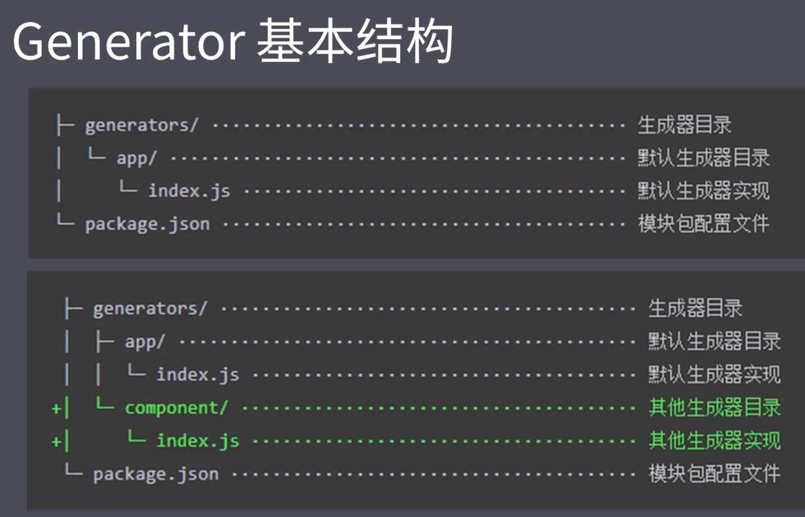

# 前端工程化

定义:遵循一定的标准和规范,通过工具提高效率的一种手段

解决的问题:

- `传统语言或语法的弊端`:使用 es6+新特性,但兼容性有问题
- 想要使用 less/sass/postcss 增强 css 的编程性,但运行环境不支持
- `无法使用模块化/组件化`:想使用模块化提高项目的可维护性,但运行环境不能直接支持
- `重复机械式工作`:部署上线前需手动压缩代码及资源文件,部署过程需手动上传代码到服务器
- `代码风格统一,质量保证`:多人协作开发,无法硬性统一大家的代码风格,从仓库中 pull 回来的代码质量无法保证
- `依赖后端服务接口支持`:部分功能开发时需等待后端服务接口提前完成
- `整体依赖后端项目`:需把前端项目打包放到后端项目中才能部署

一个项目过程中的工程化表现:

1. 创建项目: 使用 cli 创建项目结构,特定类型文件等
2. 编码: 格式化代码,校验代码风格,编译/构建/打包
3. 预览/测试: Live Reloading/HMR,Web Server/Mock,Source Map
4. 提交: Git Hooks 整体检查,Lint-staged,持续集成
5. 部署:CI/CD,自动发布

### 工程化不等于某个工具,是对项目整体规划的架构,借助某些工具实现落地工程化,如各种框架脚手架是工程化集成方案

- 内容概要

1. 脚手架工具开发
2. 自动化构建系统
3. 模块化打包
4. 项目代码规范化
5. 自动化部署

# 脚手架工具

创建项目基础结构,提供项目规范和约定

## Yeoman

通用脚手架工具
基于 nodejs 开发的工具
在全局范围安装 yo

```shell
$ npm install to --global # or yarn global add yo
```

安装对应的 generator

```shell
$ npm install generator-node --global # or yarn global add generator-node
```

通过 yo 运行 generator

```shell
$ cd path/to/project-dir
$ mkdir my-module
$ yo node
```

### Yeoman Sub Generator

generator 部分提供子集生成器
已有项目创建某些特定文件

```shell
$ yo node:cli
$ # 在全局范围使用
$ yarn link #链接到全局范围,使之成为全局模块包
$ my-module --help
```

### 使用总结

1. 明确需求
2. 找到合适的 Generator
3. 全局范围安装找到的 Generator
4. 通过 yo 运行对应的 Generator
5. 通过命令行交互填写选项
6. 生成你所需要的项目结构

### 自定义 Generator

例如:在 vue 基础骨架上引入常用的模块,vue-router 等需手动引入模块并编写一些基础代码,通过自定义脚手架可以解决

### 创建 Generator 模块

Generator 本质是一个 npm 模块
不同点:

1. 结构
   
2. 命名(yeoman 的 generator 模块必须使用该格式)
   generator-`<name>`

- 例子

```shell
$ mkdir generator-sample
$ cd generator-sample\
$ yarn init # 为了生成 package.json
$ yarn add yeoman-generator #提供生成器的基类,提供工具函数,编写更便捷
$ code . #通过 vscode 打开目录
```

创建 generator/app/index.js

```javascript
/*
此文件作为 Generator 的核心入口
需要导出一个继承自 Yeoman Generator 的类型
Yeoman Generator在工作时会自动调用我们在此类型中定义的一些生命周期方法
我们在这些方法中可以通过调用父类提供的一些工具方法实现一些功能,例如文件写入
*/
const Generator = require("yeoman-generator");
module.exports = class extends Generator {
  writing() {
    //Yeoman 自动在生成文件阶段调用此方法
    //我们这里尝试往项目目录中写入文件
    this.fs.write(this.destinationPath("temp.txt"), Math.random().toString());
  }
};
```

```shell
$ yarn link
$ cd .. #进入需要执行的目录
$ yo sample
```

### 根据模板创建文件

通常需要自动创建的文件有很多,内容复杂,可使用模板

创建 generator/app/templates/foo.txt
这是一个模板文件,内部可用 EJS 模板标记输出数据,例如:

```html
<%= title %> <% if(success){ %> 哈哈哈 <% }%>
```

generator/app/index.js 修改为:

```javascript
const Generator = require("yeoman-generator");
module.exports = class extends Generator {
  writing() {
    //Yeoman 自动在生成文件阶段调用此方法
    //我们这里尝试往项目目录中写入文件
    // this.fs.write(
    //     this.destinationPath('temp.txt'),
    //     Math.random().toString()
    // )

    //通过模板方式写入文件到目标目录
    //模板文件路径
    const tmpl = this.templatePath("foo.txt");
    //输出目标路径
    const output = this.destinationPath("foo.txt");
    //模板数据上下文
    const context = { title: "Hello zce~", success: false };

    this.fs.copyTpl(tmpl, output, context);
  }
};
```

```shell
$ yo sample
```

### 接受用户输入

使用命令行交互询问用户获得动态数据

```javascript
const Generator = require("yeoman-generator");
module.exports = class extends Generator {
  prompting() {
    //Yeoman 在询问用户环节会自动调用此方法
    //在此方法中可调用父类的 prompt()方法发出对用户的命令行询问
    return this.prompt([
      {
        type: "input",
        name: "name",
        message: "Your project name",
        default: this.appname, //appname 为项目生成目录名称
      },
    ]) //返回 promise 对象
      .then((answers) => {
        this.answers = answers;
      });
  }
  writing() {
    //Yeoman 自动在生成文件阶段调用此方法
    //我们这里尝试往项目目录中写入文件
    // this.fs.write(
    //     this.destinationPath('temp.txt'),
    //     Math.random().toString()
    // )

    //通过模板方式写入文件到目标目录
    //模板文件路径
    // const tmpl=this.templatePath('foo.txt')
    // //输出目标路径
    // const output=this.destinationPath('foo.txt')
    // //模板数据上下文
    // const context={title:'Hello zce~',success:false}

    // this.fs.copyTpl(tmpl,output,context)
    //----------------------------------------------------------
    //模板文件路径
    const tmpl = this.templatePath("bar.html");
    //输出目标路径
    const output = this.destinationPath("bar.html");
    //模板数据上下文
    const context = this.answers;

    this.fs.copyTpl(tmpl, output, context);
  }
};
```

```shell
$ yo sample
```

### Vue Generator 案例

1. 准备:首先用原始方式按理想方式创建项目目录结构
2. 封装:封装一个全新的 Generator 用于生成该项目结构
   1. 初始化
   ```shell
   $ mkdir generator-my-vue
   $ cd generator-my-vue\
   $ yarn init
   $ yarn add yeoman-generator
   $ code .
   ```
   2. 模板
      将准备好的项目文件夹内容放入 generator/app/templates, 同时将动态数据替换为 EJS 模板标记<%= name %>
   3. 入口文件
      创建 generator/app/index.js
   ```javascript
   const Generator =require('yeoman-generator')
   module.exports=class extends Generator{
       prompting(){
           return this.prompt([
               type:'input',
               name:'name',
               message:'Your project name',
               default:this.appname
           ])
       }
       writing(){
           //把每个文件都通过模板转换到目标路径
           const templates=[
               ...
               //templates 目录下的所有文件相对路径
           ]
           templates.forEach(item=>{
               this.fs.copyTpl(
                   this.templatePath(item),
                   this.destinationPath(item),
                   this.answers
               )
           })
       }
   }
   ```
   ```shell
   $ yarn link
   $ mkdir my-proj
   $ cd my-proj\
   $ yo my-vue
   ```
   `提示`:当 esj 与 html 模板语法冲突时将<% >改为<%% >

### 发布 Generator

1. github 创建新仓库,将远端地址复制下来

```shell
$ echo node_modules > .gitignore
$ git init
$ git status
$ git add .
$ git commit -m "feat: initial commit"
$ git remote add origin 远端地址
$ git push -u origin master
$ yarn publish # 注意,淘宝镜像只读,需要修改镜像配置,如:
$ yarn publish --registry=https://registry.yarnpkg.com
```

2. 进入 npm 官网,如需要在官方列表中出现,需要添加 yeoman-generator 的关键词

## Plop

小而美的脚手架工具,用于创建特定类型的文件,一般集成到项目中,自动化创建同类型的项目文件

1. 安装依赖

```shell
$ yarn add plop --dev
```

2. 创建模板文件 plop-templates/components.hbs

```javascript
import React from "react";
export default () => (
  <div className="{{name}}">
    <h1>{{ name }} Component</h1>
  </div>
);
```

3. 创建 src/plopfile.js

```javascript
//Plop 入口文件,需要导出一个函数,此函数接受一个 plop 对象,用于创建生成器任务
module.exports = (plop) => {
  plop.setGenerator("component", {
    description: "create a component",
    prompts: [
      {
        type: "input",
        name: "name",
        message: "component name",
        default: "MyComponent",
      },
    ],
    actions: [
      {
        type: "add", //代表添加文件
        path: "src/components/{{name}}/{{name}}.js",
        templateFile: "plop-templates/component.hbs",
      },
    ],
  });
};
```

```shell
$ yarn plop component
```

## 脚手架工作原理

1. 创建一个 node-cli 应用

```shell
$ mkdir sample-scaffolding
$ cd sample-scaffolding
$ yarn init
$ code .
$ yarn add inquirer
$ yarn add ejs
```

2. 修改 package.json 中指定入口文件

```javascript
"bin":"cli.js",
```

3. 创建模板 templates/
4. 创建 cli.js

```javascript
#!/usr/bin/env node
/*
 Node CLI 应用入口文件必须的文件头
 如果时 Linux 或 macOS 需修改此文件的读写权限为 755
 具体就是通过 chmod 755 cli.js 实现修改

 脚手架工作过程:
 1.通过命令行交互询问用户问题(yarn add inquirer)
 2.根据用户回答结构生成文件
*/
const fs = require("fs");
const path = require("path");
const inquirer = require("inquirer");
const ejs = require("ejs");
inquirer
  .prompt([
    {
      type: "input",
      name: "name",
      message: "Project name?",
    },
  ])
  .then((answers) => {
    const tmplDir = path.join(__dirname, "templates");
    const destDir = process.cwd();
    fs.readdir(tmplDir, (err, files) => {
      if (err) throw err;
      files.forEach((file) => {
        //通过模板引擎渲染文件 (yarn add ejs)
        ejs.renderFile(path.join(tmplDir, file), answers, (err, result) => {
          if (err) throw err;
          //将结果写入目标文件路径
          fs.writeFileSync(path.join(destDir, file), result);
        });
      });
    });
  });
```

5. 执行

```shell
$ sample-scaffolding
```
