# Vue.js 原理深度剖析

## Vue.js 基础结构

## vue 生命周期

## vue 语法和概念

1. 插值表达式
   `<div>{{'文本'}}</div>`
2. 指令
3. 计算属性和侦听器
4. Class 和 Style 绑定
5. 条件渲染/列表渲染
6. 表单输入绑定

## vue 概念和语法

1. 组件
2. 插槽
3. 插件
4. 混入 mixin
5. 深入响应式原理
6. 不同构建版本的 vue

# vue router 实现原理

1. 创建组件(视图)
   -assets/
   -components/
   -router/
   --index.js
   -views/
   --Index.vue
   --Blog.vue
   --Photo.vue
   -App.vue
   -main.js
   -...
2. 注册插件(`Vue.use(vueRoute)`)
3. 创建 vue.router 对象,配置路由规则

```javascript
// router/index.js
import Vue from "vue";
import VueRouter from "vue-router";
import Index from "../views/Index.vue";
Vue.use(VueRouter);
const routes = [
  {
    path: "/",
    name: "Index",
    component: Index,
  },
  {
    path: "/blog",
    name: "Blog",
    component: () => import(/* webpackChunkName: "blog" */ "../views/Blog.vue"),
  },
  // ...
];
const router = new VueRouter({ routes });
export default router;
```

4. 注册 route 对象,即创建 vue 对象时选项里配置创建好的 router 对象

```javascript
// main.js
import Vue from "vue";
import App from "./App.vue";
import route from "./route";
Vue.config.productionTip = false;
const vm = new Vue({
  router,
  render: (h) => h(App),
}).$mount("#app");
console.log(vm);
```

5. `<route-view>`设置占位,当路径匹配成功,用组件替换该位置->通过 `<route-link>`创建一些链接
   定义 route,装载到 router 作为参数进行 vue 实例例化

```javascript
<template>
    <div id="app">
    // ...
    <!-- 创建链接-->
    <router-link to="/">Index</router-link> |
    <router-link to="/blog">Blog</router-link> |
    <router-link to="/photo">Photo</router-link>
    // ...
    <!-- 创建占位符-->
        <router-view/>
    </div>
</template>

<style>
// ...
</style>

<script>
// ...
</script>
```

- 关于 vue 实例 vm 中的路由规则($route)和路由对象($router): 在不方便获取$route 时,如在一个插件中无法获取 $route 信息,但可通过 $router 找到 currentRoute 信息

## 动态路由

```javascript
// ...
  {
    path: "/detail/:id",
    name: "Detail",
    props:true, // 开启后将动态参数通过 props 传入对应组件
    component: () => import(/* webpackChunkName: "blog" */ "../views/ Detail.vue"), // 路由懒加载
  },
// ...
```

动态参数的获取和使用

```javascript
// Detail.vue
// 1. 通过当前路由规则,获取数据,强依赖路由
<div>{{$route.params.id}}</div>
// 2. 路由规则中开启 props 传参(推荐)
<div>{{id}}</div>
// ...
<script>
export default {
    name:'Detail',
    props:['id']
}
</script>
```

## 嵌套路由

1. 准备公共组件,并设置占位

```javascript
<template>
    
    <div>
    <router-view></router-view>
    </div>
</template>
// ...
```

2. 配置路由

```javascript
// ...
{
    path:'/',
    compontent:Layout,
    children:[
        {
            name:'index', // 命名式导航
            path:'',
            component:Index
        },
        {
            name:'detail',
            path:'detail/:id', // 支持相对路径和绝对路径
            props:true,
            component:()=>import ('@/view/Detail.vue')
        }
    ]
}
// ...
```

## 编程式导航

```javascript
this.$router.replace("/login"); // 替代当前路由,不会记录历史
this.$router.push("/login");
this.$router.push({ name: "login", params: { id: 1 } });
this.$router.go(-2); //前进/后退一页
```

## Hash 模式与 History 模式

1. 客户端路由模式(不向服务器发送请求)
2. Hash: /#/
   - 实现: 基于锚点,以及 onHashChange 事件
     - hash 模式下调用 router.push(url)时,push 方法内部会调用 window.history.pushState 如果支持直接调用 pushState 改变地址栏,否则通过 window.loaction 改变地址栏
3. History: 正常链接,需服务端配置支持
   - 实现: 基于 HTML5 中的 History API,监听 popstate 事件(浏览器前进后退等触发),
     - history 模式下调用 router.push(url)方法的时候,push 方法内部会调用 window.history.pushState,把 url 设置到浏览器地址栏,pushState 不会触发 popstate 事件,当历史状态被激活时才触发 popstate 事件,exacr-active-class 用来设置路由精确匹配的元素的样式,当浏览器地址栏路由地址为#/article 时,`<router-link to="/article/101">文章</router-link>`生成的超链接 class 属性会被设为 exact-active-class 中的类样式
     - history.pushState() IE10 后才支持
       - history.pushState 不请求,记录到历史里,`但如果刷新页面就会发请求,故需配置服务端支持`,此时服务器找不到页面返回 index.html,浏览器再次判断路由
       - 单页应用中,服务端不存在 xxx/login 这样的地址会返回找不到该页面,应该除了静态资源外都返回单页应用的 index.html
     - history.replaceState()

---

vue.router 中 replace 需要返回两次问题及解决方案

问题：现有三个页面 a , b , c , 递进关系，a 页面 router.push 跳转至 b，b 再 router.push 跳转至 c，c 使用$router.replace()回到 b，然后点击 b 页面的返回键，需要点击两次才能回到 a 页面
需求：c 保持 router.replace 至 b 方式不变，b 页面返回键点击一次正常返回 a 页面
解决方法：使用 replace 方法之后，再使用 router.go(-1)方法返回一次就可以。
例：
this.router.replacePage({name:'b'})
this.router.go(-1)
原理：先解析一下几种页面跳转方式的不同，
router.push : 跳转到新的页面，向 history 栈添加新一个新纪录，点击返回，返回到上一级页面。
router.replace: 打开新的页面，不会像 history 添加新纪录，而是直接替换掉当前记录。
router.go: 在 history 有记录的情况下，前进后退相应的页面。
页面的跳转记录就是：a->b->c->b
页面的堆栈记录则是：a->b->b
那么返回的时候路线就是 b->b->a，相当于 b 页面有两个，但由于 b 页面是一模一样的，所以视觉上是觉得点了两次返回键。
那么解决的思路就很清晰了，减少 history 中的 b 的记录，就是在用 b 替换 c 页面记录同时，回退一页，记录就变成 a->b，返回的时候自然是直接回到 a。

---

4. History 前端配置:

```javascript
// ...
const routes = [
  // ...
  {
    path: "*",
    name: "404",
    component: () => import(/* webpackChunkName: "blog" */ "../views/ 404.vue"),
  },
];
// ...
const router = new VueRouter({
  mode: "history",
  routes,
});
// ...
```

注意: vue-cli 自带 web 服务器已配置好 history 支持 5. node.js 服务器配置 History 支持
示例:使用 node,express 开发 app.js

```javascript
const path = require("path");
const history = require("connect-history-api-fallback");
const express = require("express"); // 基于 node 的web开发框架

const app = express();
// 注册处理 history 模式的中间件
app.use(history());
// 处理静态资源中间件,网站分目录../web
app.use(express.static(path.join(__dirname, "../web")));
app.listen(3000, () => {
  console.log("服务器开启,端口:3000");
});
```

6. Nginx 服务器配置值 History 支持

- 下载 nginx,打开命令行切换到解压目录
- 目录结构:
  - conf/ 配置文件
  - html/ 网站根目录(打包好的前端项目放此处)
  - ...
  - nginx.exe

```shell
$ start nginx
$ nginx -s reload
$ nginx -s stop
```

- 修改 conf/nginx.conf

```javascript
// ...
server {
    listen 80;
    server_name; //默认绑定的域名
    // ...
    location / {
        root html; //网站根目录
        index index.html index.htm;
        try_files $uri $uri/ /index.html; //按顺序尝试访问 url-> '/'-> 入口
    }
}
// ...
```

## Vue Router 实现原理 模拟分析

```txt
VueRouter类图
------------
+ options
+ data
+ routeMap
------------
+ Constructor(Options):VueRouter
- install(Vue):void
+ init():void
+ initEvent():void
+ createRouteMap():void
+ initComponents(Vue):void
```

基于 vue 的插件机制

1. 编写,见./code/vue-router/index.js

```javascript
let _Vue = null;

export default class VueRouter {
  static install(Vue) {
    // 1. 判断当前插件是否已被安装
    if (VueRouter.install.installed) {
      return;
    }
    VueRouter.install.installed = true;
    // 2. 把 Vue 构造函数记录到全局变量
    _Vue = Vue;
    // 3. 把创建 Vue 示例时候传入的 router 对象注入到所有 Vue 示例上
    //混入
    _Vue.mixin({
      beforeCreate() {
        if (this.$options.router) {
          _Vue.prototype.$router = this.$options.router;
          this.$options.router.init();
        }
      },
    });
  }

  constructor(options) {
    this.options = options;
    this.routeMap = {};
    // data:响应式对象
    this.data = _Vue.observable({
      current: "/",
    });
  }

  init() {
    this.createRouteMap();
    this.initComponents(_Vue);
    this.initEvent();
  }

  createRouteMap() {
    // 遍历所有路由规则,把路由规则解析成键值对形式 存储到 routeMap 中
    this.options.routes.forEach((route) => {
      this.routeMap[route.path] = route.component;
    });
  }

  initComponents(Vue) {
    Vue.component("router-link", {
      props: {
        to: String,
      },
      // template: '<a :href="to"><slot></slot></a>',
      render(h) {
        return h(
          "a",
          {
            attrs: {
              href: this.to,
            },
            on: {
              click: this.clickHandler,
            },
          },
          [this, $slots.default]
        ); // 子元素内容
      },
      methods: {
        clickHandler(e) {
          history.pushState({}, "", this.to);
          this.$router.data.current = this.to;
          // 当 data 发生改变会响应式替换 router-view 中的内容
          e.preventDefault();
        },
      },
    });

    const self = this;
    Vue.component("router-view", {
      render(h) {
        const component = self.routeMap[self.data.current];
        return h(component);
      },
    });
  }

  initEvent() {
    // 历史发生改变时触发 data.current 改变使重新渲染
    window.addEventListener("postate", () => {
      this.data.current = window.location.pathname;
    });
  }
}
```

2. 更改引入

```javascript
import VueRouter from "../vuerouter";
```

3. 不同 vue 版本支持(initComponents 时生成 `<router-link>`)

- vue 的构建版本

  - 运行时版:不支持 template 模板,需要打包时提前编译,vue-cli 默认使用运行时版,效率更高

    解决方法: 使用 render 函数

    ```javascript
    // ./code/vue-router/index.js
    // ...
    initComponents(Vue) {
      Vue.component("router-link", {
        props: {
          to: String,
        },
        // template: '<a :href="to"><slot></slot></a>',
        render(h) {
          return h(
            "a",
            {
              attrs: {
                href: this.to,
              },
            },
            [this, $slots.default]
          ); // 子元素内容
        },
      });
    }
    ```

  - 完整版:包含运行时和编译器,体积比运行时版大 10k 左右,程序运行时把模板转换成 render 函数

    解决方法: 新建文件 /vue.config.js

    ```javascript
    module.exports = {
      runtimeCompiler: true,
    };
    ```

# Vue 响应式原理

## 数据驱动

1. 数据响应式: 数据模型仅仅是普通的 JS 对象,当我们修改数据时,视图会进行更新,避免繁琐的 DOM 操作,提高开发效率
2. 双向绑定: 数据改变,视图改变;视图改变,数据也随之改变
3. 数据驱动:Vue 最独特的特性之一,开发过程中仅需要关注数据本身,不需要关系数据是如何渲染到视图,主流 mvvm 框架都已封装实现

## 响应式的核心原理

### Vue 2.x

基于 Object.defineProperty, 使 data 的所有属性全部转为 getter/setter, ES5 标准,只兼容 IE8+

```html
<!DOCTYPE html>
<html lang="en">
  <head>
    <meta charset="UTF-8" />
    <meta http-equiv="X-UA-Compatible" content="IE=edge" />
    <meta name="viewport" content="width=device-width, initial-scale=1.0" />
    <title>Document</title>
  </head>
  <body>
    body

    <div id="app">hello</div>
    <script>
      // 模拟 Vue 中 data 选项
      let data = {
        msg: "hello",
        count: 10,
      };
      // 模拟 vue 实例
      let vm = {};
      proxyData(data);

      function proxyData(data) {
        Object.keys(data).forEach((key) => {
          // 数据劫持:当访问或设置 vm 中成员时,做一些干预操作
          Object.defineProperty(vm, key, {
            enumerable: true, // 可枚举(遍历)
            configurable: true, // 可配置(可使用 delete 删除,可通过 defineProperty 重新定义)
            get() {
              console.log("get:", key, data[key]);
              return data[key];
            },
            set(newValue) {
              console.log("set:", key, newValue);
              if (newValue === data[key]) {
                return;
              }
              data[key] = newValue;
              document.querySelector("#app").textContent = data[key];
            },
          });
        });
      }

      // 测试
      vm.msg = "Hello World";
      console.log(vm.msg);
    </script>
  </body>
</html>
```

### Vue 3.x

基于 Proxy 代理对象,直接监听对象,而不是具体某个属性,ES6+,IE 不支持,性能由浏览器优化

```javascript
let vm3 = new Proxy(data, {
  get(target, key) {
    console.log("get,key:", key, target[key]);
    return target[key];
  },
  set(target, key, newValue) {
    console.log("set,key:", key, newValue);
    if (target[key] === newValue) {
      return;
    }
    target[key] = newValue;
    document.querySelector("#app"), (textContent = target[key]);
  },
});
```

## 发布订阅模式和观察者模式

1. vue 和 node 中的事件机制都是发布订阅模式的

```javascript
class EventEmitter {
  constructor() {
    this.subs = Object.create(null); // 创建无原型链的对象,提升性能0
  }
  // 注册事件
  $on(eventType, handler) {
    this.subs[eventType] = this.subs[eventType] || []; //确保是数组
    this.subs[eventType].push(handler);
  }
  // 触发事件
  $emit(eventType) {
    if (this.subs[eventType]) {
      this.subs[eventType].forEach((handler) => {
        handler();
      });
    }
  }
}
// 测试
let em = new EventEmitter();
em.$on("click", () => {
  console.log("click1");
});
em.$on("click", () => {
  console.log("click2");
});
em.$emit("click");
```

2. vue 的响应式机制使用了观察者模式

- 没有事件中心,只有发布者和订阅者,发布者需要知道订阅者的存在
- 观察者(订阅者)--Watcher
  - update():当事件发生时,具体要做的事
- 目标(发布者)--Dep

  - subs 数组:存储所有观察者
  - addSub():添加观察者
  - notify():当事件发生,调用观察者的 update()方法

  ```javascript
  class Dep {
    constructor() {
      this.subs = [];
    }
    addSub(sub) {
      if (sub && sub.update) {
        this.subs.push(sub);
      }
    }
    notify() {
      this.subs.forEach((sub) => {
        sub.update();
      });
    }
  }
  class Watcher {
    update() {
      console.log("update");
    }
  }
  // 测试
  let dep = new Dep();
  let watcher = new Watcher();
  
  dep.addSub(watcher);
  dep.notify();
  ```

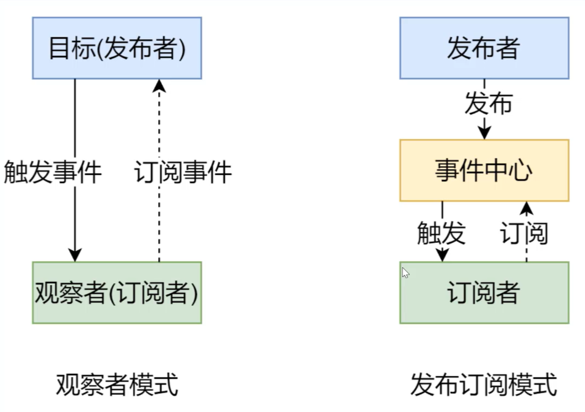
总结:

- 观察者模式是由具体目标调度,比如事件触发,Dep 就回去调用观察者的方法,所以观察者模式的订阅者预发布者之间是存在依赖的
- 发布/订阅模式由统一调度中心调用,因此发布者和订阅者不需要知道对方的存在

## Vue 响应式原理模拟

- Vue 基本结构
- 打印 Vue 实例观察
  $data:真正监视数据变化的地方
  _data:与$data 指向同一个对象,私有成员
- 整体结构
  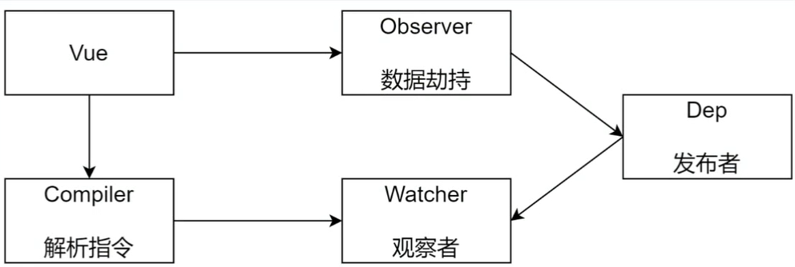
- 可以用 js 构造函数或 es6 中的类实现
- 功能:
  1. 接收初始化参数
  2. 把 data 中的属性注入到 Vue 实例,转换成 getter/setter
  3. 调用 observer 监听 data 中所有属性的变化
  4. 调用 complier 解析指令/插值表达式
- 结构

```txt
Vue
----------
+ $options
+ $el
+ $data
---------
- _proxyData()
```

- 代码

```javascript

```

### Observer

- 功能
  - 负责把 data 选项中的属性转换为响应式数据
  - data 中某个属性也是对象,把该属性转换为响应式数据
  - 数据变化发送通知
- 结构

```txt
Observer
----------
+ walk(data)
+ defineReactive(data,key,value)
```

- 代码

```javascript

```

### Compiler

实为操作 dom,此处做简化(vue 使用的虚拟 dom)

- 功能
  - 负责编译模板
  - 负责页面的首次渲染
  - 当数据变化后重新渲染视图

```txt
Compiler
----------
+ el
+ vm
----------
+ compile(el)
+ compileElement(node)
+ compileText(node)
+ isDirective(attrName)
+ isTextNode(node)
+ isElementNode(node)
```

### Dep

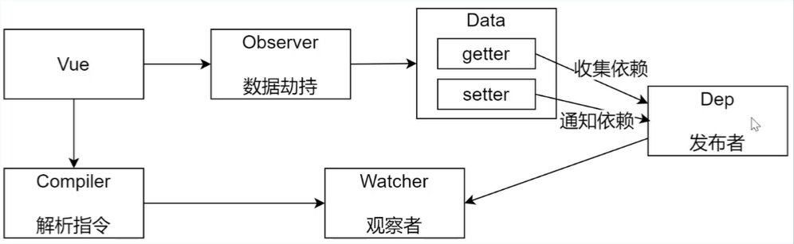

- 功能
  - 收集依赖,添加观察者(watcher)
  - 通知所有观察者

```txt
Dep
----------
+ subs
----------
+ addSub(sub)
+ notify()
```

### Watcher

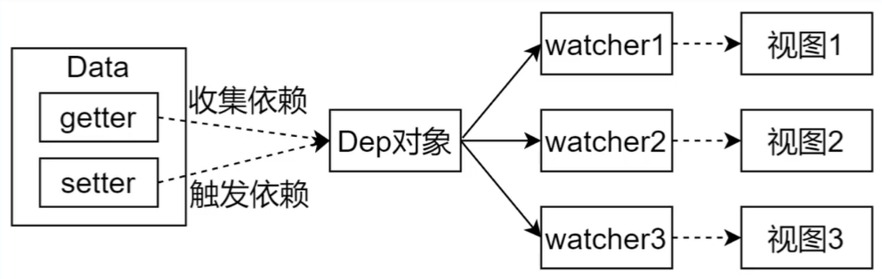

- 功能
  - 当数据变化触发依赖,dep 通知所有的 Watcher 实例更新视图
  - 自身实力话的时候往 dep 对象中添加自己
- 结构

```txt
Watcher
---------
+ vm
+ key
+ cb
+ oldValue
----------
+ update()
```

### 双向绑定机制

### 调试

1. 调试页面首次渲染过程
2. 调试数据改变更新视图的过程

- Q&A
  - vue.\_proxyData(this.$data)和new Observer(this.$data)的区别:前者把 data 中的属性注入到 vue 实例,后者把 data 中的属性转换成 getter 和 setter,并处理其他事情

## 总结

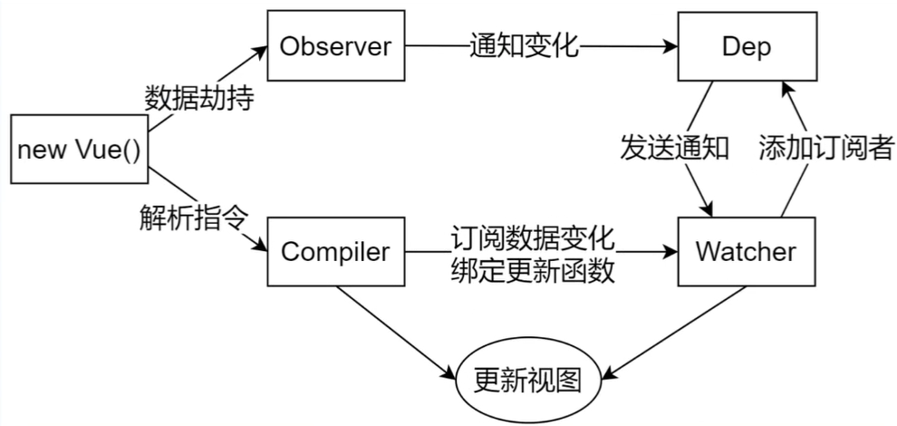

- Compiler 只在初始化时更新视图,Watcher 在数据变化时更新视图
- 问题
  - 给属性重新赋值成对象,是否是响应式的?
    - 是,observer 中的 set()已做处理
  - 给 Vue 实例新增一个成员是否是响应式的?
    - 否,只有 vue 实例初始化和更改 vue 实例 已有属性时才会触发转换成响应式的机制

---

对于已经创建的实例,vue 不允许动态添加根级别的响应式属性,但可使用 Vue.se(objecdt,propertyName,value)方法向嵌套对象添加响应式属性,

```javascript
Vue.set(vm.someObject, "b", 2);
```

或 vm.$set,这也是 Vue.set 方法的别名:

```javascript
this.$set(this.someObject, "b", 2);
```

---

# Virtual DOM

- 了解虚拟 DOM 及其作用
- Snabbdom 的基本使用(vue 通过改造此库实现虚拟 DOM)
- Snabbdom 的源码解析

## Virtual DOM

用 JS 对象来描述 DOM,创建虚拟 DOM 的开销比真实 DOM 小很多

- 为什么使用
  - 前端开发初始时代,手动操作 DOM,随功能和需求越来越复杂,出现了 MVVM 框架解决视图和状态同步问题。模板引擎可以简化视图操作,但没法跟踪状态。而虚拟 DOM 跟踪状态变化,只更新变化的 DOM
  - 参考 github 上 [virtual-dom](https://github.com/Matt-Esch/virtual-dom) 的动机描述
- 作用
  - 维护视图和状态的关系
  - 复杂视图情况下提升渲染性能
  - 跨平台
    - 浏览器平台渲染 DOM
    - 服务端渲染 SSR(Nuxt.js(vue)/Next.js(react))
    - 原生应用(Weex/React Native)
    - 小程序(mpvue/uni-app)等
- 虚拟 DOM 库
  - Snabbdom
    - Vue.js2.x 内部使用的虚拟 DOM 就是改造的 Snabbdom
    - 大约 200 SLOC(代码行)
    - 通过模块可扩展
    - 源码使用 TypeScript 开发
    - 最快的 Virtual DOM 之一
  - virtual-dom
    - 最早的开源虚拟 dom 库

## 创建项目

1. 安装 parcel(也可使用 webpack)->配置 scripts->目录结构

```shell
$ # 创建项目目录
$ md snabbdom-demo
$ cd snabbdom-demo
$ npm init -y
$ npm install parcel-bundler -D
```

```javascript
// package.json
"scripts":{
  "dev":"parcel index.html --open",
  "build":"parcel build index.html"
}
```

- init(): 高阶函数,给定参数返回一个用于比较虚拟 dom 并局部更新 的方法(patch)
  - patch():
  - 第一个参数:旧 VNode,可以使 DOM 元素
  - 第二个参数:新 VNode
  - 返回新的 VNode
- h(): 用于创建 VNode
  - 第一个参数:标签+选择器
  - 第二个参数:如果是字符串就是标签中的文本内容,是数组就是子元素

代码详见 ./code/virtual-dom/

## Snabbdom 基本使用

模块

- 作用
  - 核心库并不能处理 DOM 元素的属性/样式/事件等,可通过注册 Snabbdom 默认提供的模块来实现
  - Snabbdom 中的模块可用来扩展 Snabbdom 的功能
  - 模块的实现是通过过注册全局钩子函数(生命周期)来实现的
- 官方提供的模块
  - attributes
  - props
  - dataset
  - class
  - style
  - eventlisteners
- 模块的使用步骤
  - 导入需要的模块
  - init()中注册模块
  - h()的第二个参数使用模块

## Snabbdom 源码

- 宏观了解,带着目标看源码,看源码过程要不求甚解,调试,参考资料
- 核心:
  - init()设置模块,
  - 使用 h()创建 JS 对象(VNode)描述真实 DOM
  - patch()比较新旧两个 Vnode
  - 把变化的内容更新到真实 DOM 树
- 源码

```shell
$ git clone -b v2.1.0 --depth=1 https://github.com/snabbdom/snabbdom.git
$ # 如果出现问题:
$ npm i ttypescript@1.5.12
$ npm run compile # 源码不包含编译后的文件/build/,需自己手动编译
```

snabbdom 新版本不支持 click:[remove,movie],需把测试用例 examples 相应位置设改为 click:()=>{remove(movie)}形式

```shell
- src
-- test/ #测试用例
-- package/ #源码
---- helpers/
-------- attachto.ts #定义了 vnode 中使用的 attachData 的数据结构
---- modules/ #官方定义的6模块
-------- attributes.ts
-------- class.ts
-------- dataset.ts
-------- eventlisteners.ts
-------- hero.ts #自定义模块
-------- module.ts #定义了模块中使用到的钩子函数
-------- props.ts
-------- style.ts
---- h.ts
---- hooks.ts #定义了vnode 生命周期中用到的所有钩子函数
---- htmldomapi.ts #对 dom api 的封装,创建元素删除元素等
---- init.ts
---- is.ts #辅助模块,导出判断数组和原始值的函数
---- jsx-global.ts #jsx 类型声明文件
---- jsx.ts #用于处理 jsx
---- thunk.ts #处理对复杂视图不可变值的优化
---- tovnode.ts #提供将 dom 元素转换为 vnode 的函数
---- ts-transform-js-extension.cjs #编译时配置文件
---- tsconfig.json #编译时配置文件
---- vnode.ts #定义了 vnode 的结构
```

### h 函数

- 作用: 创建 VNode 对象
- Vue 中的 h 函数: 支持组件,而 snabbdom 不支持

```javascript
new Vue({
  router,
  store,
  render: (h) => h(App),
}).$mount("#app");
```

- h 函数最早见于 hyperscript,使用 JS 创建超文本,而 h()用 JS 创建 vnode 对象

---

#### 函数重载

- 参数个数或参数类型不同的同名函数
- JS 中没有重载的概念
- TS 中有重载,不过实现还是通过代码调整参数

#### 源码分析常用快捷键

- win
  F8 :跳到断点
  F10 :跳过方法或函数继续往后执行
  F11 :单步执行
  F12/ctrl + ← :快速定位变量定义处
  alt + ← :返回(包括文件间跳转)
  alt + → :前进
- mac
  F12 :快速定位变量定义处
  ctrl + - :返回
  ctrl + shift + - :前进

---

### VNode

### patch 整体分析过程

内部实现即 diff 算法

- patch(oldVnode,newVnode)
- 把新节点中变化的内容渲染到真实 DOM,最后返回新节点作为下一次处理的旧节点
- 对比新旧 VNode 是否相同节点(节点的 key 和 sel 相同)
- 如果不是相同节点,删除之前的内容,重新渲染
- 如果是相同节点,再判断新的 VNode 是否有 text,如果有并且和 oldVnode 的 text 不同,直接更新文本内容
- 如果新 VNode 有 children,判断子节点是否有变化

### init

### createElm

### removeVnodes 和 addVnodes

### patchVnode

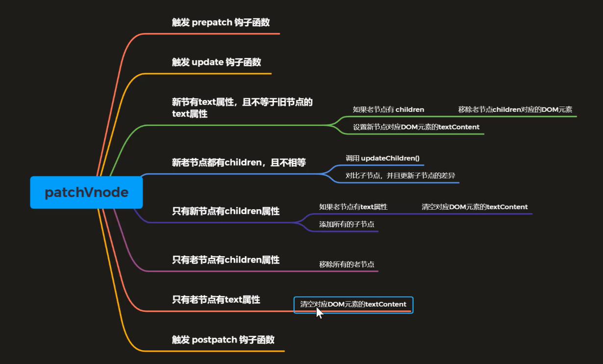

### updateChildren

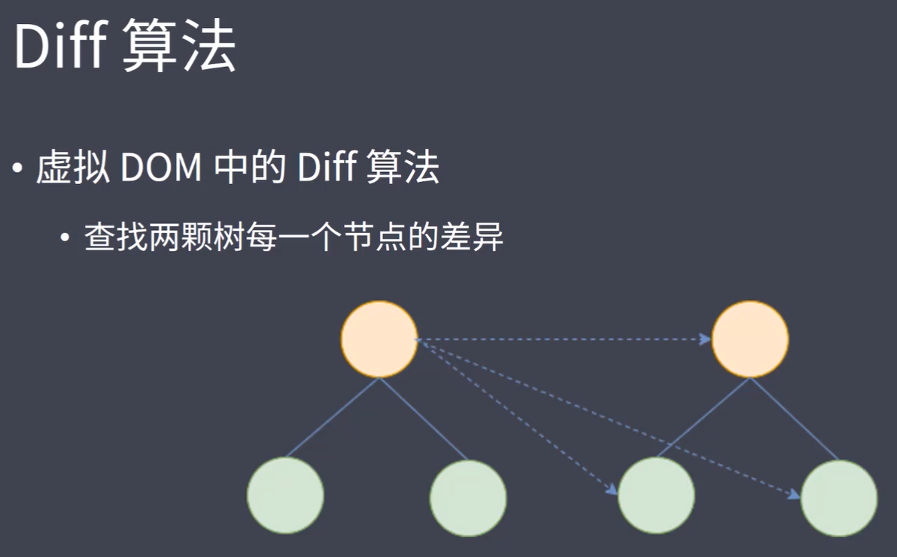
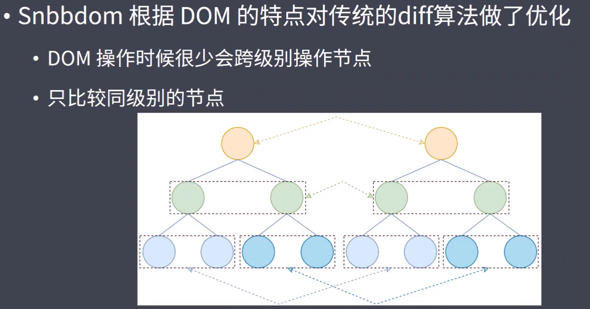
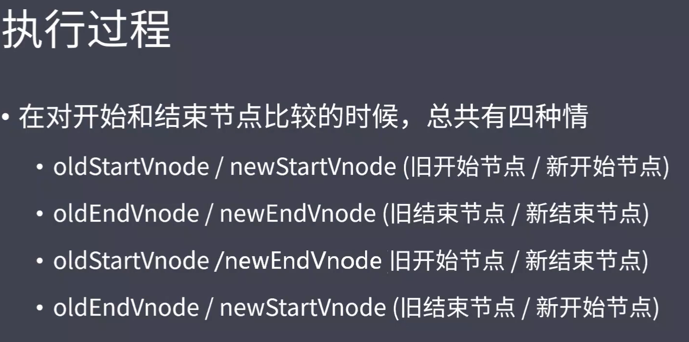
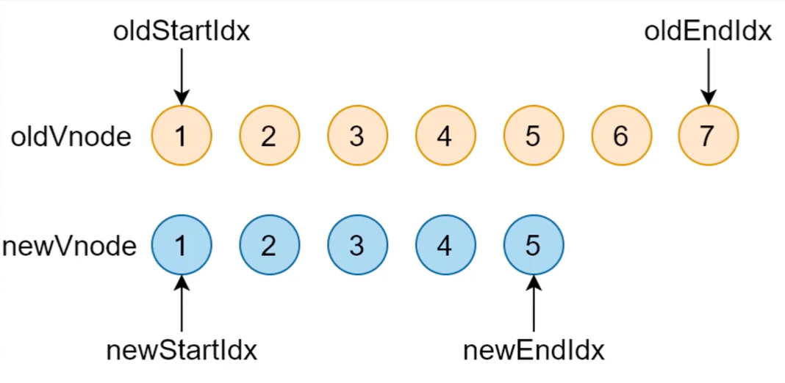
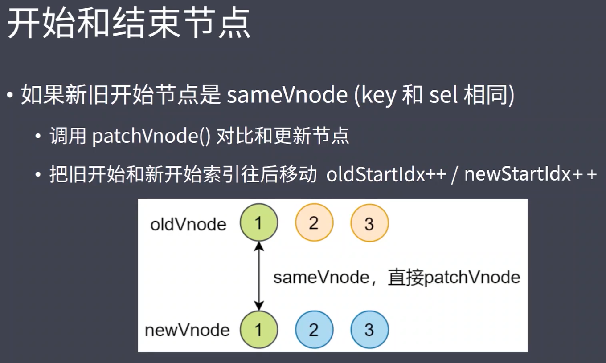
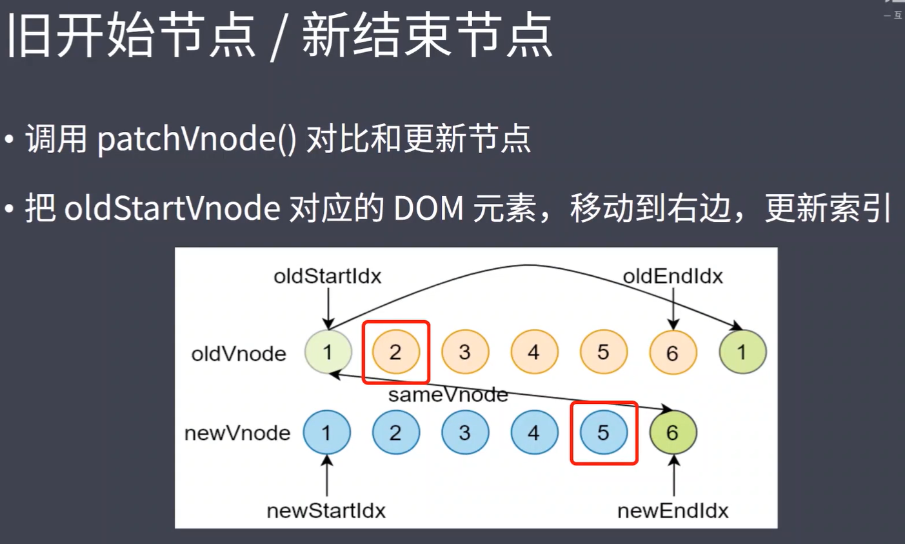
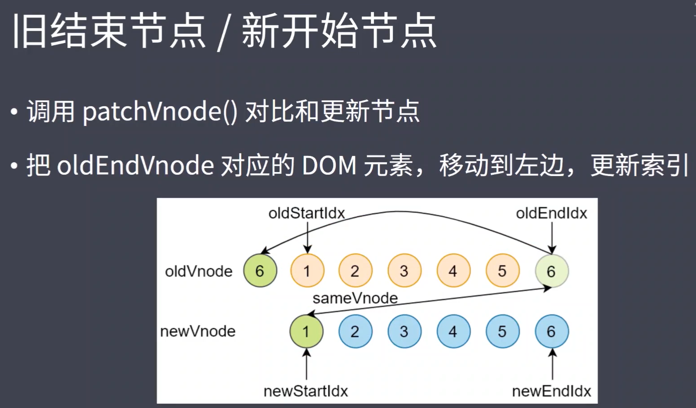
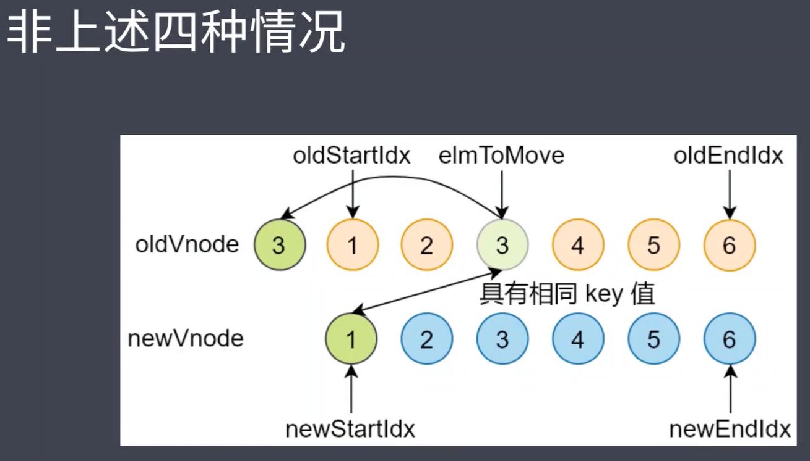
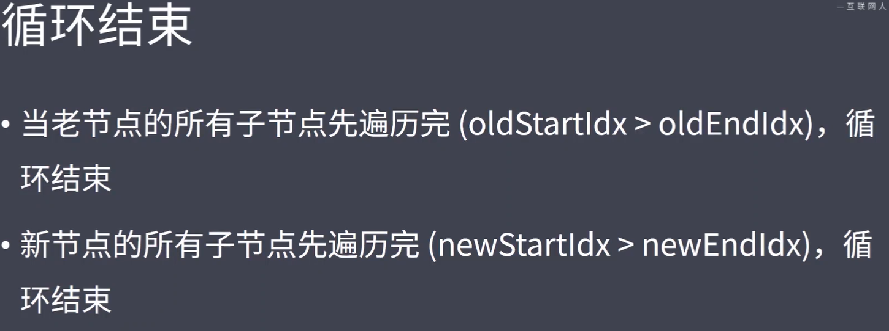
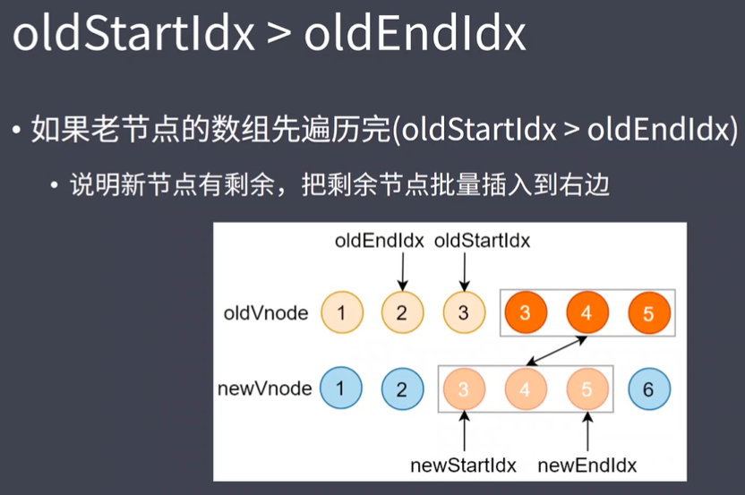
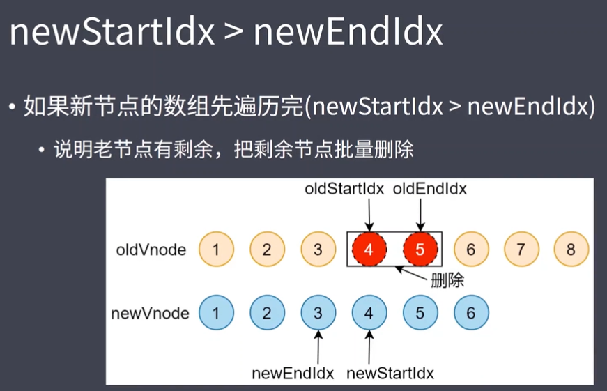

### key 值的意义

给所有具有相同父元素的子元素设置具有唯一值的 key,否则有可能因为重用 dom 造成渲染错误,遇到新插入节点时不会重用原位置节点而是重新创建节点
