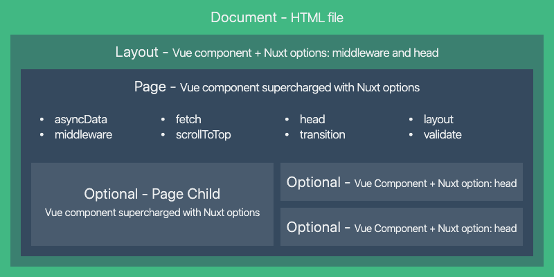

# Nuxt.js 基础

## Nuxt.js 介绍

## 是什么

- 官网：https://zh.nuxtjs.org/
- GitHub 仓库：https://github.com/nuxt/nuxt.js

Nuxt.js 是一个基于 Vue.js 的服务端渲染应用框架，它可以帮我们轻松的实现同构应用。

通过对客户端/服务端基础架构的抽象组织，Nuxt.js 主要关注的是应用的 **UI 渲染** 。

我们的目标是创建一个灵活的应用框架，你可以基于它初始化新项目的基础结构代码，或者在已有 Node.js 项目中使用 Nuxt.js。

Nuxt.js 预设了利用 Vue.js 开发 **服务端渲染** 的应用所需要的各种配置。

除此之外，我们还提供了一种命令叫：nuxt generate ，为基于 Vue.js 的应用提供生成对应的静态站点的功能。

我们相信这个命令所提供的功能，是向开发集成各种微服务（Microservices）的 Web 应用迈开的新一步。

作为框架，Nuxt.js 为 客户端/服务端 这种典型的应用架构模式提供了许多有用的特性，例如异步数据加载、中间件支持、布局支持等非常实用的功能。

#### 使用方式

- 初始项目
- 已有的Node.js 服务端项目, 直接把 Nuxt 当成一个中间件集成到 Node Web Server 中
- 现有 Vue.js 项目(非常熟悉 Nuxt.js, 至少百分之 10代码改动)

## 特性

- 基于 Vue.js
- Vue、Vue Router、Vuex、Vue SSR
- 自动代码分层
- 服务端渲染
- 强大的路由功能，支持异步数据
- 静态文件服务
- ES2015+ 语法支持
- 打包和压缩 JS 和 CSS
- HTML 头部标签管理
- 本地开发支持热加载
- 集成 ESLint
- 支持各种样式预处理器： SASS、LESS、 Stylus 等等
- 支持 HTTP/2 推送

## Nuxt.js 框架是如何运作的


Nuxt.js 集成了以下组件/框架，用于开发完整而强大的 Web 应用：

- Vue.js
- Vue Router
- Vuex
- Vue Server Renderer

压缩并 gzip 后，总代码大小为： **57kb** （如果使用了 Vuex 特性的话为 60kb）。

另外，Nuxt.js 使用 Webpack 和 vue-loader 、 babel-loader 来处理代码的自动化构建工作（如打包、代码分层、压缩等等）。

## 创建项目

Nuxt 提供了两种方式用来创建项目：

- 使用 create-nuxt-app 脚手架工具
- 手动创建
  
  > 为了让大家有一个更好的学习效果，这里我们建议先通过手动创建的方式来学习 Nuxt，熟悉了 Nuxt 的基本能使用之后，我们会在后面的综合案例中学习如何使用 create-nuxt-app 创建项目。

（ 1 ）准备

```shell
# 创建示例项目
mkdir nuxt-app-demo

# 进入示例项目目录中
cd nuxt-app-demo

# 初始化 package.json 文件
npm init -y

# 安装 nuxt
npm innstall nuxt
```

在 package.json 文件的 scripts 中新增：

```json
"scripts": {
"dev": "nuxt"
},
```

上面的配置使得我们可以通过运行 npm run dev 来运行 nuxt。

（ 2 ）创建页面并启动项目

创建 pages 目录：

```shell
mkdir pages
```

创建我们的第一个页面 pages/index.vue：

```html
<template>
  <h1>Hello world!</h1>
</template>
```

然后启动项目：

```shell
npm run dev
```

```vue
// pages/index.vue 代码
<template>
	<div id="app">
    <h2>{{title}}</h2>
    <ul>
      <li
          v-for="item in posts"
          :key="item.id"
      >{{item.title}}</li>
  	</ul>
  </div>
</template>

<script>
import axios from 'axios'
  
export default {
  name:'Home',
  components:{},
  // Nuxt 中提供的一个钩子函数, 专门用于获取页面服务端渲染的数据
  async asyncData(){
    const {data}=await axios({
      method:'GET',
      url:'http://localhost:3000/data.json', // 必须使用完整地址, 服务端渲染时相对地址会变化
    })
    // 这里返回的数据会和 data(){}中的数据合并到一起给页面使用
    return data
  }
}
</script>
```

注意: data.json 放到 static 目录, 这里开放为 web 根目录

所有页面的父模板:layouts/default.vue

```vue
<template>
	<div>
    <!-- 路由出口-->
    <ul>
      <li>
        <!--类似 router-link, 用于单页应用导航-->
        <nuxt-link to="/">Home</nuxt-link>
      </li>
      <li>
        <nuxt-link to="/about">About</nuxt-link>
      </li>
    </ul>
    <!-- 子页面出口, 子页面将渲染到这里-->
    <nuxt />
	</div>
</template>
```


现在我们的应用运行在 [http://localhost:3000](http://localhost:3000) 上运行。

> 注意：Nuxt.js 会监听 pages 目录中的文件更改，因此在添加新页面时无需重新启动应用程序。

（ 3 ）Nuxt 中的基础路由

Nuxt.js 会依据 pages 目录中的所有 \*.vue 文件生成应用的路由配置。

假设 pages 的目录结构如下：

```
pages/
--| user/
-----| index.vue
-----| one.vue
--| index.vue
```

那么，Nuxt.js 自动生成的路由配置如下：

```javascript
router: {
  routes: [
    {
      name: 'index',
      path: '/',
      component: 'pages/index.vue',
    },
    {
      name: 'user',
      path: '/user',
      component: 'pages/user/index.vue',
    },
    {
      name: 'user-one',
      path: '/user/one',
      component: 'pages/user/one.vue',
    },
  ]
}
```

## Nuxt 路由

Nuxt.js 依据 pages 目录结构自动生成 vue-router 模块的路由配置。

### 基础路由

假设 pages 的目录结构如下：

```
pages/
--| user/
-----| index.vue
-----| one.vue
--| index.vue
```

那么，Nuxt.js 自动生成的路由配置如下：

```javascript
router: {
  routes: [
    {
      name: 'index',
      path: '/',
      component: 'pages/index.vue',
    },
    {
      name: 'user',
      path: '/user',
      component: 'pages/user/index.vue',
    },
    {
      name: 'user-one',
      path: '/user/one',
      component: 'pages/user/one.vue',
    },
  ]
}
```

### 路由导航

- a 标签 , 刷新导航,走服务端渲染
- <nuxt-link> 组件, 用法同 router-link
- 编程式导航, 也是单页应用方式, 用法同 vue router 编程式导航

### 动态路由

在 Nuxt.js 里面定义带参数的动态路由，需要创建对应的 **以下划线作为前缀** 的 Vue 文件 或 目录。

以下目录结构：

```
pages/
--| _slug/
-----| comments.vue
-----| index.vue
--| users/
-----| _id.vue
--| index.vue
```

Nuxt.js 生成对应的路由配置表为：

```javascript
router: {
  routes: [
    {
      name: 'index',
      path: '/',
      component: 'pages/index.vue',
    },
    {
      name: 'users-id',
      path: '/users/:id?',
      component: 'pages/users/_id.vue',
    },
    {
      name: 'slug',
      path: '/:slug',
      component: 'pages/_slug/index.vue',
    },
    {
      name: 'slug-comments',
      path: '/:slug/comments',
      component: 'pages/_slug/comments.vue',
    },
  ]
}
```

你会发现名称为 users-id 的路由路径带有 :id? 参数，表示该路由是可选的。如果你想将它设置为必选的路由，需要在 users/\_id 目录内创建一个 index.vue 文件。

### 嵌套路由

你可以通过 vue-router 的子路由创建 Nuxt.js 应用的嵌套路由。

创建内嵌子路由，你需要添加一个 Vue 文件，同时添加一个 **与该文件同名** 的目录用来存放子视图组件。

> Warning: 别忘了在父组件(.vue 文件) 内增加 <nuxt-child/> 用于显示子视图内容。

假设文件结构如：

```
pages/
--| users/
-----| _id.vue
-----| index.vue
--| users.vue
```

Nuxt.js 自动生成的路由配置如下：

```javascript
router: {
  routes: [
    {
      path: '/users',
      component: 'pages/users.vue',
      children: [
        {
          path: '',
          component: 'pages/users/index.vue',
          name: 'users',
        },
        {
          path: ':id',
          component: 'pages/users/_id.vue',
          name: 'users-id',
        },
      ],
    },
  ]
}
```

### 路由配置
- https://zh.nuxtjs.org/api/configuration-router

## 视图


### 模板

app.html

```html
<!DOCTYPE html>
<html {{ HTML_ATTRS }}>
  <head {{ HEAD_ATTRS }}>
    {{ HEAD }}
  </head>
  <body {{ BODY_ATTRS }}>
    {{ APP }}
  </body>
</html>
```

### 布局

（ 1 ）默认布局

（ 2 ）自定义布局

```
layouts/
--default.vue // 自定义默认布局
--foo.vue // 自定义其他布局, 也可以是 error
```

```vue
// pages/index.vue
<script>
  export default {
    name:'HomePage',
    layout:'foo' // 指定布局为 foo.vue
  }
</script>
```


<nuxt /> 页面出口

（ 3 ）错误页面

### 页面

### HTML 页面头部

（ 1 ）默认 Meta 标签

（ 2 ）个性化特定页面的 Meta 标签

## 异步数据

### asyncData 方法

Nuxt.js 扩展了 Vue.js，增加了一个叫* asyncData *的方法，使得我们可以在设置组件的数据之前能
异步获取或处理数据。

- 将 asyncData 返回的数据容和组件 data 方法返回数据一并给组件

- 调用时机: 服务端渲染时, 客户端路由导航前

#### 注意事项

- 只能在页面组件中使用(即只能是 pages 目录下的组件)
- 没有 this, 他是在组件初始化之前被调用的, 但可以使用参数 context获取数据

#### 小结

- 当你想要动态页面内容有利于 SEO 或是提升首屏渲染速度时,就在 asyncData 中发请求拿数据
- 非异步数据或普通数据,正常初始化到 data 中即可

### 上下文对象

asyncData(context)

### 错误处理

## 生命周期

| 钩子函数      | 说明                                                         | Server | Client |
| :------------ | ------------------------------------------------------------ | ------ | ------ |
| beforeCreate  | 在实例创建之前被调用，此时还拿不到数据和 DOM。               | ✔      | ✔      |
| created       | 在实例创建完成后被调用，此时可以操作数据了。                 | ✔      | ✔      |
| beforeMount   | 在挂载开始之前被调用：相关的 render 函数首次被调用。         | ❌      | ✔      |
| mounted       | 实例被挂载后调用，此时可以执行一些初始 DOM 操作。            | ❌      | ✔      |
| beforeUpdate  | 数据更新时调用，发生在虚拟 DOM 打补丁之前。这里适合在更新之前访问现有的 DOM，比如手动移除已添加的事件监听器。 | ❌      | ✔      |
| updated       | 由于数据更改导致的虚拟 DOM 重新渲染和打补丁，在这之后会调用该钩子。当这个钩子被调用时，组件DOM 已经更新，所以你现在可以执行依赖于 DOM 的操作。 | ❌      | ✔      |
| activated     | 被 keep-alive 缓存的组件激活时调用。                         | ❌      | ✔      |
| deactivated   | 被 keep-alive 缓存的组件停用时调用。                         | ❌      | ✔      |
| beforeDestroy | 实例销毁之前调用。在这一步，实例仍然完全可用。               | ❌      | ✔      |
| destroyed     | 实例销毁后调用。该钩子被调用后，对应 Vue 实例的所有指令都被解绑，所有的事件监听器被移除，所有的子实例也都被销毁。 | ❌      | ✔      |
| errorCaptured | 当捕获一个来自子孙组件的错误时被调用。                       | ✔      | ✔      |


## 插件

## 模块

## Vuex 状态管理
> https://nuxtjs.org/guide/vuex-store

## Nuxt 渲染流程

下图阐述了 Nuxt.js 应用一个完整的服务器请求到渲染（或用户通过 <nuxt-link> 切换路由渲染页
面）的流程：

## Nuxt 常见问题
> https://zh.nuxtjs.org/faq/

## Nuxt 官方示例
> https://zh.nuxtjs.org/examples

