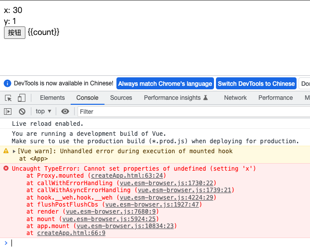

# Vue.js 3.0

vue3 源码全部采用 ts 重写,项目的组织方式采用 monorepo

- 新增 Compos ition API, 解决超大组件不好拆分和重用的问题
- 性能提升, 使用 proxy()重写响应式代码, 对编译器做优化, 重写了虚拟 DOM, 渲染和 update 性能大幅提升, 服务端渲染性能提升 2-3 倍
- Vite, 不需打包直接运行, 提升开发效率

## 源码组织方式

- 源码采用 TypeScript 重写
- 使用 Monorepo 管理项目结构
  packages 目录结构

```shell
  ┣ packages
    ┣ # 与编译相关代码
    ┣
    ┣ compiler-core # 与平台无关的编译器
    ┣ compiler-dom # 浏览器平台下的编译器,依赖于 compiler-core
    ┣ compiler-sfc # single file component 单文件组件,用于编译单文件组件,依赖于 -core 和 -dom
    ┣ compiler-ssr # 服务端渲染编译器,依赖于 -dom
    ┣ reactivity # 数据响应式系统,可独立使用
    ┣ runtime-core # 与平台无关的运行时
    ┣ runtime-dom # 浏览器平台的运行时,处理原生 DOM Api,事件等
    ┣ runtime-test # 测试用的轻量级运行时,渲染出的 DOM 树是一个 JS 对象,可运行在所有 JS 环境里,可用于测试渲染是否正确,还可用于序列化 DOM,触发 DOM 事件,记录某次更新中的 DOM 操作
    ┣ server-renderer # 服务端渲染
    ┣ shared # 内部使用的公共 API
    ┣ size-check # 私有包,作用是 tree-shaking 后检查包大小
    ┣ template-explorer # 浏览器运行的实时编译组件,会输出 render 函数, README 里提供在线访问地址
    ┣ vue # 构建完整版 vue,依赖于 compiler 和 runtime
    ┣ global.d.ts
```

## Vue.js3.0 不同构建版本

1. 与 vue2 不同是,vue3 中不再构建 umd 模块化的方式, 因为 umd 需要更多冗余,需要支持多种模块化方式
2. vue3 的构建版本中,把 cjs,esm 和自执行函数的方式分别打包到了不同文件中

- packages/vue 存放了 vue3 的所有构建版本

```shell
  ┣ vue
    ┣ _tests_
    ┣ dist
      ┣ # commonjs, 这两个都是完整版 vue,包含运行时和编译器
      ┣ vue.cjs.js # 开发版,未压缩
      ┣ vue.cjs.prod.js
      ┣ # global, 这四个都可在浏览器中直接通过 script 标签导入, 导入后会增加一个全局的 vue 对象
      ┣ vue.global.js
      ┣ vue.global.prod.js
      ┣ vue.runtime.global.js # 只包含运行时的构建版本
      ┣ vue.runtime.global.prod.js
      ┣ # brower, 都包含 esm, 浏览器原生模块化方式,在浏览器中可直接通过 <script type="module"来导入
      ┣ vue.esm-browser.js
      ┣ vue.esm-browser.prod.js
      ┣ vue.runtime.esm-browser.js
      ┣ vue.runtime.esm-browser.prod.js
      ┣ # bundler, 用于打包所有代码,需要配合打包工具使用,都是用 esm, 内部通过 import 导入了 runtime-core
      ┣ vue.esm-bundler.js
      ┣ vue.runtime.esm-bundler.js # 内部额外导入了 runtime-compiler, 使用脚手架默认导入的是该文件, 只导入运行时的最小版本, 重新打包时只打包使用到的代码,让 vue 的体积更小
```

## Composition API

- RFC (Request For Comments)
  - 注释请求 vue2 升级 vue3 的大变动都是通过 RFC 机制确认, 首先官方给出提案,然后收集社区反馈并讨论,最终确认
  - https://github.com/vuejs/rfcs
- Composition API RFC
  - Composition RFC 文档,介绍了 composition 的使用
  - https://composition-api.vuejs.org

### 设计动机

- vue2 开发大型项目并长期迭代时会有限制,一些功能复杂的组件可能很难看懂, 因为使用的 Options API
- Options API

  - 包含一个描述组件选项（data、methods、props 等）的对象,通过选项对象创建组件
  - Options API 开发复杂组件，同一个功能逻辑的代码被拆分到不同选项, 难以提取可重用逻辑
  - 虽然有 mixin 机制,但存在命名冲突, 数据来源不清晰等问题

- Composition API
  - Vue.js 3.0 新增的一组 API, Options API 仍可用
  - —组基于函数的 API
  - 可以更灵活的组织组件的逻辑

Composition API Demo

- 好处是查看某个逻辑时只需要关注具体函数,当前逻辑代码都封装在函数内部,不像 Options API 分散在不同位置

```javascript
import { reactive, onMounted, onUnmounted } from 'vue'
function useMousePosition() {
  const position = reactive({
    x: 0,
    y: 0,
  })
  const update = (e) => {
    position.x = e.pageX
    position.y = e.pageY
  }
  onMounted(() => {
    window.addEventListener('mousemove', update)
  })
  onUnmounted(() => {
    window.removeEventListener('mousemove', update)
  })
  return position
}
export default {
  setup() {
    const position = useMousePosition()
    return {
      position,
    }
  },
}
```


- Composition API 提供了一组基于函数的 api,可用更灵活的组织组件的逻辑,更合理的组织组件内部代码结构,还可以把组件功能提取出来,方便其他组件重用

## Vue.js 3.0 性能提升

### 性能提升

- 响应式系统升级
- 编译优化
- 源码体积的优化

#### 响应式系统升级

- Vue.js 2.x 中响应式系统的核心 defineProperty
- Vue.js 3.0 中使用 Proxy 对象重写响应式系统, 性能更好
- 代理对象可拦截属性的访问,赋值,删除等操作,不需要初始化时遍历所有属性
- 如果有多层属性嵌套,只有访问某个属性时,才递归处理下一级属性
- 可以监听动态新增的属性, vue2 中需要调用 Vue.set()
- 可以监听数组的索引和 length 属性

#### 编译优化

- 通过优化编译过程和重写虚拟 DOM,让首次渲染和更新的性能有大幅提升

```vue
<template>
  <div id="app">
    <div>
      static root
      <div>static node</div>
    </div>
    <div>static node</div>
    <div>static node</div>
    <div>{{ count }}</div>
    <button @click="handler">button</button>
  </div>
</template>
```

vue2 构建中将模板转换成渲染函数, 编译时编译静态根节点(要求有一个静态子节点)和静态节点,渲染的最小单位是组件,diff 过程跳过静态根节点, 静态节点还需要 diff

- Vue.js 2.x 中通过标记静态根节点，优化 diff 的过程
- Vue.js 3.0 中标记和提升所有的静态(根)节点，diff 的时候只需要对比动态节点内容

  - Fragments （需升级 vetur 插件）片段,新特性,模板中不需要再创建一个唯一的根节点,模板内可直接放文本内容

    - vue3 在线编辑器, 开启 hoistStatic 和 cacheHandles
      

    \_createBlock()创建根节点,\_createVNode()创建子节点,类似 h(),虚拟 DOM 中 diff 是最耗时的

  - 静态提升, 将静态节点写到外面预定义
  - Patch flag (,1 /_TEXT, PROPS _/) 有标记时只对比绑定内容
  - 缓存事件处理函数 (\_cache\[1]||(\_cache\[1]=(...)=>{...})) handle 无变动从 cache 中取值

#### 优化打包体积

- Vue.js 3.0 中移除了一些不常用的 API
- 例如：inline-template、filter 等,可通过 method 或计算属性实现
- Tree-shaking 依赖 esm 结构(import export),通过编译阶段的静态分析,找到没有引入的模块,在打包时直接过滤,打包后体积更小
- vue3 设计时就考虑到了 tree-shaking,内置组件比如 transaction,keep-alive,一些内部指令 v-model 都是按需引入
- 很多新 api 都是支持 tree-shaking,如果未使用是不打包的

### Vue.js 3.0 Vite

vite 比过去基于 webpack 的 vue-cli 更快

#### ES Module

- 现代浏览器都支持 ES Module （IE 不支持）
- 通过下面的方式加载模块
  - `<script type="module" src="..." ></script>`
- 支持模块的 script 默认延迟加载
  - 类似于 script 标签设置 defer
  - 在文档解析完成后，DOM 树创建完毕后,触发 DOMContentLoaded 事件前执行

#### Vite as Vue-CLI

- Vite 在开发模式下不需要打包可以直接运行
- Vue-CLI 开发模式下必须对项目打包才可以运行
- vue 会开启一个测试服务器,拦截浏览器发送的请求,获取相应模块,vite 会对浏览器不识别的模块进行处理,如 import 单文件组件(.vue)时用@vue/compiler-sfc 编译,编译结果返回浏览器:以下为浏览器过程
  
  - 浏览器请求时响应头被设置 conten-Type:javascript,即接收 js 脚本,返回的是编译后的 render 函数,
  - 这时需要到导入的路径去请求, 通过请求带参数为 template 的请求返回
- 优点
  - 快速冷启动
  - 按需编译
  - 模块热更新,而且性能与模块总数无关始终较快
  - Vite 在生产环境下使用 Rollup 打包
    - 基于 ES Module 的方式打包,不需要 babel 再把 import 转换成 require 以及相应的辅助函数,打包后的体积更小
    - Vue-CLI 使用 Webpack 打包

#### Vite 创建项目

- 创建项目

```shell
$ npm init vite-app <project-name>
$ cd <project-name>
$ npm install
$ npm run dev
```

- 基于模板创建项目,支持其他框架

```shell
$ npm init vite-app —template react # react 即要使用的框架,
$ npm init vite-app —template preact
```

# Compositon API

- 案例:使用 vue.esm-browser.js 完整版 vue
  - 不借助任何工具,使用原生 esm
    代码: createApp/

#### createApp()

- 生成的 vue 对象比 vue2 少很多,没有$开头,mount,unmount类似于$mount 和$destory

#### setup()

- setup()是在 beforeCreate 和 created 之间执行的, 对应代码可以写到 setup 中
- setup 参数:
  1. props,接收传入的参数,响应式对象,不能被解构
  2. context, 成员: attrs,emit,slots
- 返回对象,可使用在模板,methods,computed,生命周期钩子中

### Compositon API 生命周期钩子函数

| Options API     | Hook inside inside setup |
| --------------- | ------------------------ |
| beforeCreate    | Not needed\*             |
| created         | Not needed\*             |
| beforeMount     | onBeforeMount            |
| mounted         | onMounted                |
| beforeUpdate    | onBeforeUpdate           |
| updated         | onUpdated                |
| beforeUnmount   | onBeforeUnmount          |
| unmounted       | onUnmounted              |
| errorCaptured   | onErrorCaptured          |
| renderTracked   | onRenderTracked          |
| renderTriggered | onRenderTriggered        |

- 在 render 重新调用时触发两个钩子:renderTracked 首次调用不会触发,renderTriggered 会,

### Compositon API reactive/toRefs/ref

#### reactive

- position 是返回的 proxy 对象, 通过 position.x 访问时调用的 proxy 对象中的 getter 拦截收集依赖,当 position.x 变化时会调用 setter 拦截触发更新
  - 相当于定义了 x, y 两个变量来接收 position.x 和 position.y, 而基本类型的赋值就是把值在内存中复制一份, 解构出来的只是基本类型的变量, 与代理对象无关, 当给 x,y 重新赋值时也不会调用 setter ,无法触发更新操作

#### toRefs

- 将响应式对象(代理对象)中的所有属性也转换成响应式的对象然后挂载到新创建的对象上,最后返回
  - 它内部会为代理对象每个属性创建一个具有 value 属性的对象,该对象是响应式的
  - value 属性具有 getter 和 setter,与 ref 函数类似
  - 解决解构后的子对象是普通对象的问题

#### ref

- 把普通数据转换成响应式数据, 与 reactive 不同的是, reactive 把对象转换成响应式数据,ref 可以把基本类型数据包装成响应式数据
  1. 参数是对象,内部就是调用 reactive
  2. 参数是基本类型,内部会创建一个只有 value 属性的对象,该对象的 value 属性有 getter 和 setter
     Computed
- 提示

## 

#### Computed

简化模板中的代码,缓存计算结果,当数据变化后才重新计算

- 第一种用法
  `computed(() => count.value + 1) `
  - computed()返回一个不可变的响应式对象
- 第二种用法

```javascript
const count = ref(1)
const plusOne = computed({
  get: () => count.value + 1,
  set: (val) => {
    count.value = val - 1
  },
})
```

#### Watch

- Watch 的三个参数
  - 第一个参数：要监听的数据: 函数,ref 或 reactive 返回的对象, 数组等
  - 第二个参数：监听到数据变化后执行的函数，这个函数有两个参数分别 是新值和旧值
  - 第三个参数：选项对象，deep 和 immediate
- Watch 的返回值
  - 取消监听的函数

#### WatchEffect

- WatchEffect -是 watch 函数的简化版本，也用来监视数据的变化
- 接收一个函数作为参数(没有回调函数的参数)，监听函数内响应式数据的变化
- 立即执行,当数据变化重新运行该函数,返回一个取消监听的函数

### ToDoList

- ToDoList 功能列表

  - 添加待办事项
  - 删除待办事项
  - 编辑待办事项
    - 双击待办项，展示编辑文本框
    - 按回车或者编辑文本框失去焦点，修改数据
    - 按 esc 取消编辑
    - 把编辑文本框清空按回车，删除这一项
    - 显示编辑文本框的时候获取焦点(使用自定义指令)
  - 切换待办事项
    - 点击 checkbox,改变所有待办项状态
    - 显示未完成待办项个数
    - 移除所有完成的项目
    - 如果没有待办项，隐藏 main 和 footer
    - 切换待办事项状态
  - 存储待办事项

- ToDoList 项目结构

#### 自定义指令

- vue2

```javascript
Vue.directive('editingFocus', {
  bind(el, binding, vnode, prevVnode) {},
  inserted() {},
  update() {}, // remove
  componentUpdated() {},
  unbind() {},
})
// 传函数写法(在 bind 和 update 时执行)
Vue.directive('editingFocus', (el, binding) => {
  binding.value && el.focus()
})
```

- vue3

```javascript
app.directive('editingFocus', {
  beforeMount(el, binding, vnode, prevVnode) {},
  mounted() {},
  beforeUpdate() {}, // new
  updated() {},
  beforeUnmount() {}, // new
  unmounted() {},
})
// 传函数写法(与 vue2 一致)(在 mounted 和 updated 时执行)
app.directive('editingFocus', (el, binding) => {
  // el: 指令绑定的元素
  // binding: 获取指令对应的值,通过 binding.value 获取
  binding.value && el.focus()
})
```

### 响应式原理

Vue.js 响应式回顾

- Proxy 对象实现属性监听
- 多层属性嵌套，在访问属性过程中处理下一级属性
- 默认监听动态添加的属性
- 默认监听属性的删除操作
- 默认监听数组索引和 length 属性
- vue3 响应式系统可以作为单独的模块使用

  核心方法

- reactive/ref/toRefs/computed
- effect
- track 收集依赖
- trigger 触发更新

vue3 runtime.core 中的函数

- watch 内部使用了 effect 底层函数实现
- watchEffect

#### 响应式原理

- Proxy 对象回顾
- 问题:
  - 如果有 Reflect 中有能代替 Object 方法的方法,尽量使用 Reflect
  - set 和 deleteProperty中需要返回布尔类型的值,在严格模式下,如果返回 false 会出现 Type Error 的异常
  - 


- 接收一个参数，判断这参数是否是对象 
- 创建拦截器对象 handler，设置 get/set/deleteProperty
- 返回 Proxy 对象

#### 收集依赖

  
  
#### reactive vs ref
- ref 可以把基本数据类型数据，转成响应式对象
- ref 返回的对象，重新赋值成对象也是响应式的
- reactive 返回的对象，重新赋值丢失响应式,(ref无法解构,只能用 .value访问,如果把.value 解构后的数据也丢失响应式)
- reactive 返回的对象不可以解构
- 如果一个对象成员非常多时用 reactive 更方便,只有一两个响应式数据,使用 ref 更方便
#### toRefs
将 reactive 返回的对象的所有属性转换成对象,当对响应式对象解构时,解构出的每个属性都是响应式对象(类似ref,使用.value 访问),而对象是按引用传递,所以解构出的数据依然是响应式的
- 如果使用 reactive 但不解构,使用 p.a形式; 如果解构,要使用 a.value (有点脱裤子放屁)

### Vite

- Vite 是一个面向现代浏览器的一个更轻、更快的 Web 应用开发工具
- 它基于 ECMAScript 标准原生模块系统(ES Modules)实现,省略模块的打包,即时编译
- 解决 webpack 在开发阶段使用 devServer 冷启动时间过长,HMR 热更新慢的问题
- 少了很多配置文件和依赖  
  Vite 项目依赖
- Vite(目前只支持 vue3,也可支持其他框架)
- @vue/compiler-sfc 用于编译.vue 单文件组件(vue2 使用的是 vue-template-compiler)
  基础使用
```
 vite serve (不需要编译所有代码文件,启动速度快)
 vite build
```
- vite serve

- vue-cli—service serve

- Vite HMR
  - 立即编译当前所修改的文件
- Webpack HMR
  - 会自动以这个文件为入口重写 build —次，所有的涉及到的依赖也都会 被加载一遍
```
 vite build
```
- 采用Rollup
- Dynamic import
  - 动态导入有相应Polyfill(补丁用以支持)
---
  打包 or 不打包
- 使用 Webpack 打包的两个原因： 
  - 浏览器环境并不支持模块化
  - 零散的模块文件会产生大量的 HTTP 请求(HTTPR 可复用连接)
---
开箱即用
- TypeScript -内置支持
- less/sass/stylus/postcss -内置支持（需要单独安装对应编译器）
- JSX
- Web Assembly

#### Vite 特性(提升开发者开发体验) 
- 快速冷启动 
- 模块热更新 
- 按需编译 
- 开箱即用

### Vite 实现原理
Vite 核心功能 
- 静态 Web 服务器
- 编译单文件组件 
  - 拦截浏览器不识别的模块，并处理(如单文件组件编译)
- HMR(通过 websocket)
  
##### 实践
实现一个能开启静态 web 服务器的命令行工具
vite 内容使用 koa
- 详见 vite-cli
写完后使用`npm link`链接到npm 安装目录里
在一个基于 vue3开发的项目中使用`vite-cli`开启静态 web 服务器


第一次请求会将单文件组件编译成组件的选项对象,然后返回给浏览器,但选项对象中没有模板或 render 函数
处理第二次请求会带参数 type=template
第二次请求将把模板编译成 render 函数

---
错题
1. 单选题[单选题]以下选项中关于vite的特性说法不正确的是(20分)
实现了真正的按需编译
没有打包的过程， 源码直接传输给浏览器
基于浏览器原生 ES imports, 因而有更快的冷启动和热更新
整体速度与模块数量有关

B 选项 回答错误， 正确答案为 D

2. 多选题[多选题]关于vite实现原理说法正确的是(20分)
vite 通过对请求径劫持获取资源的内容返回给浏览器
vite 对所有 import 都做了处理，用带有 **@modules** 的前缀重写它们
vite 热更新实现在client端， webSocket监听了一些更新的类型
vite 热更新实现在server端，通过watcher监听页面改动

B 选项 回答错误， 正确答案为 ACD
